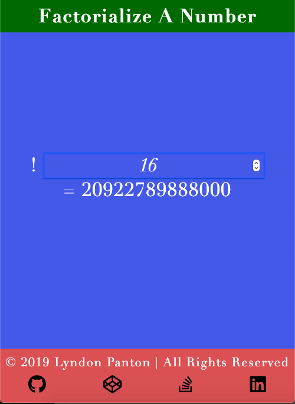

# Factorialize A Number

## How To Open
> 1. Go to the project's download folder
> 2. Right click on the file named _index.html_
> 3. Choose the _open with_ option
> 4. Open the project in your desired browser

## How To Use
> 1. Enter a number in the input field
> 2. If the number is valid and small enough the factoral of that number will be displayed

## Requirements
> 1. This project requires a browser to run
> 2. The browser must have JavaScript available and enabled

## Extra Information
> 1. This was done for one of _freecodecamp_'s _Basic Algorithm Scripting_ activities

## Preview

